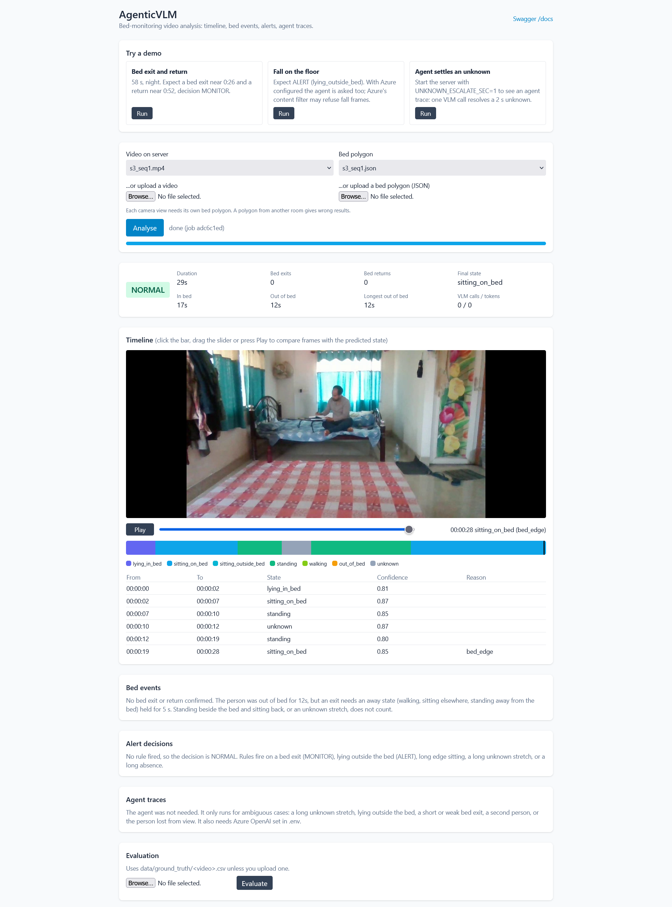

# AgenticVLM

Agentic AI + Vision prototype: watches a continuous indoor video of an elderly person and produces an
activity timeline, bed-exit / return events, per-state durations and `NORMAL` / `MONITOR` / `ALERT` decisions.

See [docs/architecture.md](docs/architecture.md) for the design and
[docs/alert-rules.md](docs/alert-rules.md) for the alert rules.

## Run

```bash
uv venv --python 3.11            # creates .venv
uv sync --extra dev              # installs app + dev tools from pyproject.toml
cp .env.example .env

# UI at http://localhost:8000/  ·  Swagger at http://localhost:8000/docs  ·  API under /api/v1
uv run uvicorn app.main:app --reload

# or CLI
uv run python -m app.cli analyze data/videos/<file>.mp4 --roi data/rois/<file>.json

uv run pytest
uv run ruff check . && uv run ruff format .
```

A bed polygon is required per scene: `data/rois/<video_stem>.json` = `{"bed_polygon": [[x, y], ...], "frame_size": [w, h]}`.
Results go to `outputs/<job_id>/` (`timeline.txt`, `summary.json`, `events.json`, `alerts.json`,
`agent_traces.json`, `raw_result.json`).

The UI (one HTML page, Tailwind from the CDN, so it needs internet) lets you pick a video and bed polygon from `data/` or upload them,
then shows a frame preview with a scrubber and Play button next to the timeline (so you can check each predicted state against the picture), summary, bed events, alert decisions, agent traces and an evaluation.
It only calls the public `/api/v1` endpoints. Frames come from the server as JPEGs, so any file OpenCV can read previews fine (browsers cannot play the stitched `mp4v` files).

## Prepare test data and evaluate

```bash
# 1. join same-scene clips; also writes a ground-truth template data/ground_truth/<name>.csv
uv run python -m app.cli stitch data/videos/seq1.mp4 clipA.mp4 clipB.mp4 clipC.mp4

# 2. bed polygon: click the corners in a window, or pass them: --points "x,y x,y x,y x,y"
uv run python -m app.cli roi data/videos/seq1.mp4            # writes data/rois/seq1.json + a preview image

# 3. fill in the states in data/ground_truth/seq1.csv (start_sec,end_sec,state; contiguous from 0)
# 4. analyze, then evaluate the job folder that step prints
uv run python -m app.cli analyze data/videos/seq1.mp4 --roi data/rois/seq1.json
uv run python -m app.cli evaluate --job outputs/<job_id> --gt data/ground_truth/seq1.csv --video data/videos/seq1.mp4
```

`evaluate` writes `evaluation.json` (accuracy, per-class scores, confusion matrix, event precision/recall,
duration errors), `failure_cases.md` and `failure_frames/` into the job folder. The API equivalent is
`POST /api/v1/evaluation/{job_id}`. Copy the failure cases into `docs/failure-cases.md` and write down why each failed.

## Agent (optional)

Fill in the five `AZURE_OPENAI_*` values in `.env` to switch on the reasoning agent. It only looks at ambiguous
cases (long UNKNOWN, possible fall, short bed exit, out of view, second person), uses cached, capped, low-detail
VLM calls, and leaves its steps in `outputs/<job_id>/agent_traces.json` (also `GET /api/v1/analysis/{job_id}/traces`).
`AZURE_OPENAI_ENDPOINT` is the resource root (no `/openai/v1`) and the API version looks like `2025-04-01-preview`. Leave the values empty and the pipeline runs on the rules alone. Details: [docs/architecture.md](docs/architecture.md).

## Status

Working: ingestion, extract, state, events, alerting, reasoning (agent + Azure OpenAI), reporting, evaluation,
data prep (stitch, bed polygon), analysis (API + CLI). Not built yet: annotated video, evaluation notebook.

## Notes

- Ultralytics models are AGPL-3.0.
- Stitched test sequences have artificial cuts.
- Datasets: GMDCSA-24 (CC BY 4.0), UR Fall Detection (CC BY-NC-SA 4.0); FallVision if used.

## Why these models

| Part | Choice | Why |
|---|---|---|
| Person + posture | Ultralytics YOLO pose (`yolo26s-pose`) | One network pass gives a box and 17 COCO keypoints per person, fast enough on a CPU or free Colab T4. Keypoints give the posture the rules need (torso angle, knee angle, hips). A plain detector would not. No training needed: pretrained on COCO |
| Model size | small, not nano | Measured, not guessed: on a fall clip the nano model detected the person in 29 of 51 frames, small in 44, medium in 45. Small also lifted `s2_night` accuracy from 82.8 % to 86.2 %. Medium cost more for almost no gain |
| Tracking | ByteTrack (built into Ultralytics) | Keeps a stable ID for the monitored person and tells them from a caregiver. It matches boxes by motion (Kalman filter) and overlap, and also uses low-confidence boxes in a second pass, which suits partly hidden people. A re-lock rule handles ID switches |
| State logic | Hand-written rules + a state machine, not a learned classifier | Every threshold can be explained and unit-tested with synthetic data, and the brief asks for `UNKNOWN` instead of a forced guess. Cost: thresholds were set by looking at two videos (see Results) |
| Contrast | CLAHE on the lightness channel | Night clips are dark and low-contrast; this lifts detection without changing colours |
| Agent + VLM | Azure OpenAI vision (`gpt-5-mini`, stronger model for hard cases) | Pose cannot tell "lying on the bed" from "lying on the floor" in a confusing scene, or whether someone left or only stood. A VLM can read the picture. It is only asked about ambiguous segments, with 3-4 small frames, a disk cache and a call cap, so it costs little. It never decides `ALERT`; rules do |

What the pose model is bad at: people lying toward the camera, motion blur, and bodies cut off by the frame edge (see [docs/failure-cases.md](docs/failure-cases.md)). The system's answer is to say `UNKNOWN`, to judge a fall by the box shape and bed position instead of the torso angle, and to hand the rest to the agent.

## Results

Rules only (no Azure calls), `yolo26s-pose`, 5 fps. Ground truth is labelled by eye from contact sheets (about ±1 s).

| Video | Length | Frame accuracy | Lying / sitting / standing / walking recall | Bed exit | Return | False exits |
|---|---|---|---|---|---|---|
| `s2_night` (GMDCSA-24 Subject 2, 5 night clips) | 58 s | 86.2 % | 1.00 / 0.95 / 1.00 / **0.00** | 1 of 1 | 1 of 1 | 0 |
| `s3_seq1` (Subject 3, day clips) | 29 s | 85.7 % | 1.00 / 1.00 / 0.80 / **0.00** | 0 of 1 | 0 of 1 | 0 |

Duration error per state (seconds, predicted vs ground truth; walking time is mostly read as standing):

| State | `s2_night` truth / predicted / error | `s3_seq1` truth / predicted / error |
|---|---|---|
| lying_in_bed | 12.9 / 12.4 / **0.5** | 2.4 / 2.0 / **0.4** |
| sitting_on_bed | 20.1 / 19.5 / **0.6** | 14.2 / 14.9 / **0.7** |
| standing | 17.6 / 26.2 / **8.5** | 8.8 / 9.9 / **1.1** |
| walking | 7.5 / 0.0 / **7.5** | 3.4 / 0.0 / **3.4** |
| unknown | 0.0 / 0.0 / **0.0** | 0.0 / 2.0 / **2.0** |
| total absolute error | **17.1 s** of 58.1 s | **7.6 s** of 28.8 s |

How honest are these numbers?
- **Two short videos, hand-labelled, from two people in one room.** I looked at both while fixing the system, so they are a
  development set, not a held-out test. Treat them as "the pipeline works on these", not as an accuracy claim.
- **Walking is never detected.** Speed over 1 s does not separate walking from standing on this data (measured in `plans/07`). Durations of
  walking and standing are therefore wrong, but bed exit and return are still found because standing with hips outside the bed counts as exit evidence.
- **`s3_seq1` misses its bed exit:** a 2 s `UNKNOWN` while the person is at the frame edge breaks the standing run before it reaches the 5 s
  confirmation. With the agent switched on (`UNKNOWN_ESCALATE_SEC=1` to trigger it on a 29 s clip) the agent resolved that segment as `standing`
  (1 VLM call, 1507 tokens), but I did not re-evaluate the events with it.
- **Falls:** one floor fall clip (Subject 3 Fall 18) gives `ALERT`; no false ALERT on four floor-sitting clips. Other fall clips are too short
  or land on the bed. One clean fall clip is weak evidence.
- Metrics, confusion matrices and per-state durations are in each job's `evaluation.json`.

Failure cases with frames and explanations: [docs/failure-cases.md](docs/failure-cases.md). How each fix was decided: `plans/05` to `plans/07`.



## What I'd do differently with more time

- **More and longer evaluation data.** Ten or more stitched sequences with several people and rooms, labels checked by a second person, and a
  held-out set I do not tune on. Toyota Smarthome (long continuous video) would test the 10-minute rules, which no clip here reaches.
- **Walking vs standing from gait,** not hip speed: alternating knee angles over about a second, which does not depend on which way the person faces the camera.
- **A learned posture classifier on pose features** (small MLP or temporal model on keypoint sequences), or an HMM/Viterbi decoder over the
  rule outputs, instead of hand thresholds. I kept rules because they are explainable and unit-testable; the cost is thresholds that I set by looking at two videos.
- **Falls:** a descent-speed feature to separate a fall onto the bed from lying down, and a fallback for when the VLM refuses fall frames
  (Azure's content filter rejected them in my test). Detect a person who vanishes mid-room sooner than 10 s of `UNKNOWN`.
- **Bed geometry:** the bed is a flat polygon in the image, so a person standing at the foot of the bed can have hips "inside" it. A floor-plane
  homography or a bed segmentation mask would fix that.
- **Annotated video export** (skeleton, polygon, state overlay) and a notebook that walks through the evaluation. Neither is built.
- **Observability for production:** OpenTelemetry tracing of the pipeline and agent calls. Not needed for a prototype with no collector.
- **Night signal** for "bed exit at night is riskier": a brightness or clock input. Today every exit is `MONITOR`.
