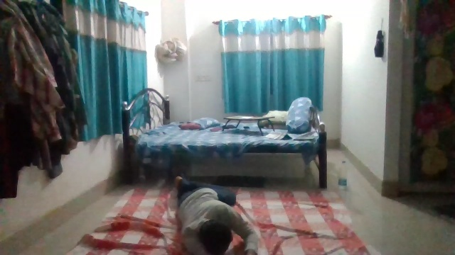
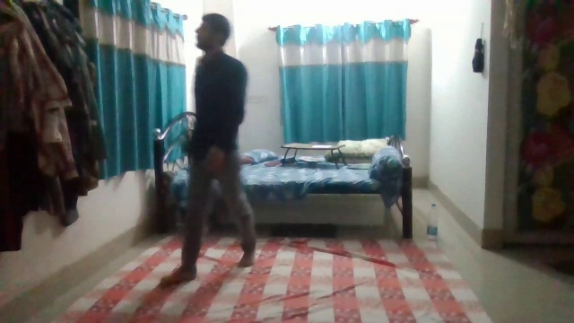
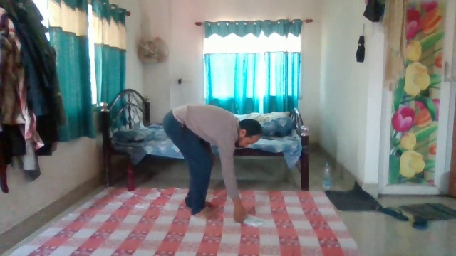

# Failure cases

Taken from real runs of the current code, rules only unless stated. Ground truth for the stitched videos was labelled by eye
(about ±1 s), so misses within one second of a boundary are weak evidence. Videos: `s2_night` (58 s, GMDCSA-24 Subject 2 night
clips), `s3_seq1` (29 s, Subject 3 day clips), and one fall clip (GMDCSA-24 Subject 3 Fall 18). Numbers in the README results.

## 1. A fall is not detected (fixed for this clip, see below)
- **Where:** Subject 3 Fall 18, 4.6-11.9 s. The person gets off the bed, falls and lies face down on the floor.
- **Truth:** on the floor (outside the bed). There is no state for this, so there is no ground-truth row either.
- **Predicted:** `UNKNOWN [no_person_detected]` from 4.6 s to the end, overall decision `NORMAL` (empty `alerts.json`).
- **Frame:** 
- **Why:** the pose model almost never detects a prone, motion-blurred person. From 6 s to 12 s only 6 of 30 sampled frames contain a
  detection, with confidence 0.28-0.45, and none of them has a tracker ID (the tracker gave no ID to these low-confidence boxes; I
  did not dig into why), so the extractor cannot re-lock onto them. The 7 s of `UNKNOWN` is under `UNKNOWN_ESCALATE_SEC` (10 s) and `UNKNOWN_MONITOR_SEC` (30 s),
  so nothing escalates and nothing alerts. On a longer video the agent would be asked after 10 s, but only after the person had lain
  there that long.
- **With the agent** (`UNKNOWN_ESCALATE_SEC=5`): the case was escalated (`track_lost`), the VLM call was rejected by Azure's content-safety
  filter ("input image may contain content that is not allowed"), the agent fell back to `UNKNOWN`, confidence 0, and alerting gave `MONITOR`
  (`agent_low_confidence`), not `ALERT`. The safe fallback worked as designed, but it means fall footage may be filtered often.
- **Update (plan 07):** two changes. (a) The default pose model is now `yolo26s-pose` (raw detections after 5 s on this clip: nano 29/51,
  small 44/51). (b) With the person found, the torso rule still said `SITTING_OUTSIDE_BED`, because someone lying face down toward the
  camera has a torso that looks vertical in the image. A box at least as wide as tall, with hips outside the bed, is now
  `UNKNOWN [lying_outside_bed]`, and this clip gives `ALERT` (`lying_outside_bed`). No false ALERT on four floor-sitting clips
  (Subject 3 ADL 13-16). Remaining limits: only one clean floor-fall clip exists (1 of 1 is weak evidence); Fall 12 is a floor fall but
  4.3 s long and ends 1.3 s after landing, under the 2 s dwell; Falls 02, 10, 17 land on the bed and look like lying down. The content-filter
  problem with the VLM is unchanged.
- **Earlier ideas, not done:** treat "person was on/near the bed, then vanished" as a possible fall sooner than 10 s; run the detector at a
  lower confidence on the region where the person was last seen; fine-tune on lying poses (out of scope here).

## 2. Walking is labelled as standing
- **Where:** `s2_night` 28-30 s, 36-37 s, 46-50 s (7 s of walking, recall 0/7); `s3_seq1` 2 s of walking, recall 0.
- **Truth:** `walking`. **Predicted:** `standing` (reason `away_from_bed`, so the bed exit is still found).
- **Frame:** 
- **Why (probable, not isolated):** hip speed over a 1 s window read 0.13-0.25 bbox heights/s during these stretches, under
  `WALKING_SPEED_MIN` (0.3). Walking partly toward the camera and stride-phase hip movement shrink the measured displacement in image
  space. I did not test other thresholds on purpose: lowering it to fit two short videos would fit those videos, and sway while sitting
  up reaches 0.2-0.3.
- **Measured (plan 07):** hip speed in the ground-truth walking seconds has median 0.18 (p90 0.27) on `s2_night`, but standing has p90 0.19; on
  `s3_seq1` walking (median 0.07) is slower than standing (0.10). Bounding-box-centre speed is no better. So speed alone does not separate them
  here, and I left the threshold alone rather than fit it to two short videos. A gait signal (alternating knee angles) is the next thing to try.
- **Cost:** duration split between walking and standing is wrong; bed exit and return are still correct because standing outside the
  bed counts as evidence.

## 3. Person at the frame edge becomes UNKNOWN
- **Where:** `s3_seq1` 10-12 s. The person is standing at the left edge of the frame, partly cut off.
- **Truth:** `standing`. **Predicted:** `UNKNOWN`.
- **Frame:** 
- **Why:** frame confidence (the lower of detection confidence and visible-keypoint share) is 0.26-0.57, mostly under `STATE_CONFIDENCE_MIN` (0.5), and
  the rules prefer `UNKNOWN` to a guess. The segment is only 2 s, so it counts against accuracy but would not trigger
  a `MONITOR`.
- **With the agent** (`UNKNOWN_ESCALATE_SEC=1`, 1 VLM call, 1507 tokens): resolved as `standing`, confidence 0.78 ("clearly off the
  mattress and standing at the foot of the bed"), and the timeline became `standing` 8-20 s. This is the case the agent is for.
  I lowered the escalation threshold only to trigger it on a 29 s clip; at the default 10 s it would not have run.

## 4. Sit-up boundary is called lying for one second
- **Where:** `s2_night` 25-26 s, and `UNKNOWN` at 26-28 s (the person swings legs off the bed and stands).
- **Truth:** `sitting_on_bed`. **Predicted:** `lying_in_bed [reclined]` for the first second, then `UNKNOWN`.
- **Why:** plan 06 treats a torso at 35° or more with hips inside the bed as lying, because a person propped on a pillow reads 38-52°.
  A person rising to sit passes through the same angles, so the label lags by about a second. The following `UNKNOWN` is a fast
  movement with low pose confidence. Both are close to the ±1 s uncertainty in the labels, so I would not tune against them.

## Agent problems found while testing (fixed or config)
- `gpt-5-mini` rejected `temperature=0` (HTTP 400), so every VLM call failed and the agent always returned `UNKNOWN`. Fixed in
  `azure_vlm.py`; reproducibility comes from the disk cache.
- A `.env` endpoint ending in `/openai/v1` and an `API_VERSION` that is a model version (404 "Resource not found"). Documented in `.env.example`.
